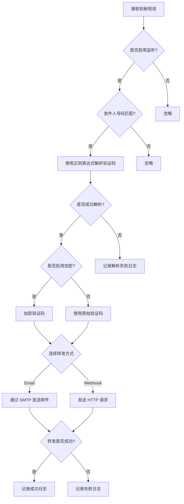

# SmsBridge

SmsBridge 是一款 Android 应用程序，可作为短信网关，将短信验证码转发到各种服务。对于需要将验证码从手机转发到其他设备或服务的开发者、测试人员和用户来说，它非常有用。

## 主要功能

- **短信转发**: 通过电子邮件、HTTP 请求转发短信验证码。
- **日志记录**: 详细记录收到的每条验证码，包括发件人、短信内容、解析结果、转发方式和状态。
- **日志管理**: 日志查看、清理。
- **灵活配置**: 通过设置界面轻松配置不同转发方式的参数。

## 运行流程

## 小米手机（MIUI）使用配置说明

为了确保 SmsBridge 在小米手机上能够稳定地在后台运行并接收短信，您需要进行以下手动配置。MIUI 的省电和权限管理策略非常严格，可能会阻止应用在后台正常工作。

**请按照以下步骤操作：**

1.  **修改省电策略**:
    *   打开 **设置** -> **应用设置** -> **应用管理**。
    *   找到 **SmsBridge** 并点击进入应用信息页面。
    *   点击 **省电策略**。
    *   选择 **无限制**。
    *   这将防止系统在后台为了省电而终止应用。

3.  **允许通知类短信权限**
    *   在 **SmsBridge** 的应用信息页面中，进入 **权限管理**-> **其他权限**-> **通知类短信**。
    *   找到并允许 **始终允许** 权限。
    *   小米手机默认无法读取通知类的短信，需开启通知类短信权限。

完成以上步骤后，SmsBridge 应该就能在您的小米设备上稳定运行了。如果仍然遇到问题，请检查应用的通知权限是否已开启，以确保您能收到应用的状态通知。

## 应用截图

